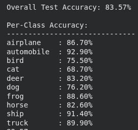

<div align="center">

# 🧠 Visual Attention CNN with Explainability

**A CNN with custom CBAM attention mechanism built from scratch in PyTorch**


</div>

---

## 🎯 What This Project Does

Most CNNs are black boxes — they make predictions but give no insight into *why*. This project builds a CNN that:

- 🔍 Learns **where to look** using a custom spatial + channel attention mechanism (CBAM)
- 🎯 Achieves **83.57% test accuracy** on CIFAR-10, trained entirely from scratch
- 🗺️ Generates **attention heatmaps** overlaid on images showing model decision regions
- 🔬 Proves through **ablation experiments** that attention genuinely improves performance
- ⚙️ Every component — tokenizer, architecture, training loop — written from scratch

---

## 🗺️ Attention Heatmaps

> The model highlights *exactly* where it looks before making a prediction.

| Original | Attention Overlay |
|:---:|:---:|
| 🐱 Cat image | Model focuses on face & body |
| 🚢 Ship image | Model focuses on hull & waterline |

---

## 📁 Project Structure

```
visual-attention-cnn/
│
├── 📂 models/
│   └── model.py              # ChannelAttention, SpatialAttention, CBAM, CNNBlock, AttentionCNN
│
├── 📂 utils/
│   ├── dataset.py            # CIFAR-10 data pipeline
│   ├── train.py              # Custom training loop
│   ├── evaluate.py           # Accuracy + per-class metrics
│   └── visualize.py          # Attention heatmap generation
│
├── 📂 weights/
│   ├── best_model.pth             # ✅ Best — Deeper + CosineAnnealingLR (83.57%)
│   ├── deep_model_weights.pth     # Deeper + StepLR (80.86%)
│   ├── model_weights.pth          # Baseline CBAM (72.83%)
│   └── no_cbam_model_weights.pth  # No attention (71.17%)
│
├── 📊 Test_Accuracy.png      # Final model results
├── 📓 main.ipynb             # Full pipeline notebook
├── requirements.txt
└── README.md
```

---

## 🏗️ Model Architecture

```
Input (3 × 32 × 32)
        │
        ▼
┌─────────────────────┐
│  CNNBlock(3 → 32)   │  ← Conv → BN → ReLU → CBAM
└─────────────────────┘
        │
        ▼
┌─────────────────────┐
│  CNNBlock(32 → 64)  │  ← stride=2 → 16×16
└─────────────────────┘
        │
        ▼
┌──────────────────────┐
│  CNNBlock(64 → 128)  │  ← stride=2 → 8×8
└──────────────────────┘
        │
        ▼
┌───────────────────────┐
│  CNNBlock(128 → 256)  │  ← stride=2 → 4×4
└───────────────────────┘
        │
        ▼
  AvgPool → Flatten
        │
        ▼
  Linear(256→256) → ReLU → Dropout(0.5)
        │
        ▼
   Linear(256→10)
        │
        ▼
  Class Prediction + Attention Heatmap
```

### 🔍 Inside CBAM

```
Feature Map (B × C × H × W)
         │
         ▼
┌──────────────────────────────┐
│     Channel Attention        │  "What to focus on"
│  AvgPool ──┐                 │
│            ├──► MLP ──► + ──►│──► Sigmoid ──► Scale channels
│  MaxPool ──┘                 │
└──────────────────────────────┘
         │
         ▼
┌──────────────────────────────┐
│     Spatial Attention        │  "Where to focus"
│  ChannelAvg ──┐              │
│               ├──► 7×7 Conv ─│──► Sigmoid ──► Scale spatial
│  ChannelMax ──┘              │
└──────────────────────────────┘
         │
         ▼
  Attended Feature Map
```

---

## 📊 Experiment Results



### Overall Accuracy Comparison

| Model | Test Accuracy | Δ vs Baseline |
|:---|:---:|:---:|
| ❌ No Attention (baseline) | 71.17% | — |
| ✅ CBAM + StepLR | 72.83% | +1.66% |
| ✅ Deeper + CBAM + StepLR | 80.86% | +9.69% |
| 🏆 **Deeper + CBAM + CosineAnnealingLR** | **83.57%** | **+12.40%** |

### Per-Class Accuracy (Best Model — 83.57%)

| Class | Accuracy | Bar |
|:---|:---:|:---|
| 🚗 Automobile | 92.90% | ████████████████████░ |
| 🚢 Ship | 91.40% | ███████████████████░░ |
| 🚛 Truck | 89.90% | ██████████████████░░░ |
| 🐸 Frog | 88.60% | █████████████████░░░░ |
| ✈️ Airplane | 86.70% | █████████████████░░░░ |
| 🦌 Deer | 83.20% | ████████████████░░░░░ |
| 🐴 Horse | 82.60% | ████████████████░░░░░ |
| 🐶 Dog | 76.20% | ███████████████░░░░░░ |
| 🐦 Bird | 75.50% | ██████████████░░░░░░░ |
| 🐱 Cat | 68.70% | █████████████░░░░░░░░ |

### 🔑 Key Findings

> **CBAM helps on complex classes:** Airplane +10.5%, Bird +7.2% — spatial focus matters most for fine-grained features
>
> **CosineAnnealingLR vs StepLR:** +2.71% — proves scheduler choice significantly impacts convergence
>
> **Cat is hardest:** 68.70% — model frequently confuses cats with dogs at 32×32 resolution, a known CIFAR-10 challenge

---

## ⚙️ Setup & Usage

### 1. Install dependencies
```bash
pip install -r requirements.txt
```

### 2. Run the notebook
Open `Attention.ipynb` in **Google Colab** with T4 GPU runtime and run all cells.

### 3. Train from scratch
```python
from models.model import AttentionCNN
from utils.dataset import get_dataloaders
from utils.train import train_model

train_loader, test_loader = get_dataloaders()
model = AttentionCNN(num_classes=10)
trained_model = train_model(model, train_loader, test_loader, epochs=30)
```

### 4. Evaluate
```python
from utils.evaluate import evaluate_model

evaluate_model(model, test_loader, model_path='weights/best_model.pth')
```

### 5. Visualize attention heatmaps
```python
from utils.visualize import visualize

visualize(model, test_loader, num_images=5)
```

---

## 🛠️ Technical Details

| Component | Detail |
|:---|:---|
| Framework | PyTorch |
| Dataset | CIFAR-10 — 50K train / 10K test / 32×32 RGB |
| Optimizer | Adam (lr=0.001) |
| Scheduler | CosineAnnealingLR (T_max=30) |
| Regularization | Dropout(0.5) + RandomCrop + RandomHorizontalFlip |
| Training | 30 epochs on Google Colab T4 GPU |
| Attention Viz | Forward hooks + bilinear upsampling to 32×32 |

---

## 📦 Requirements

```
torch
torchvision
datasets
numpy
matplotlib
opencv-python
Pillow
```

---

<div align="center">

Built from scratch — no pretrained weights, no shortcuts.

</div>
